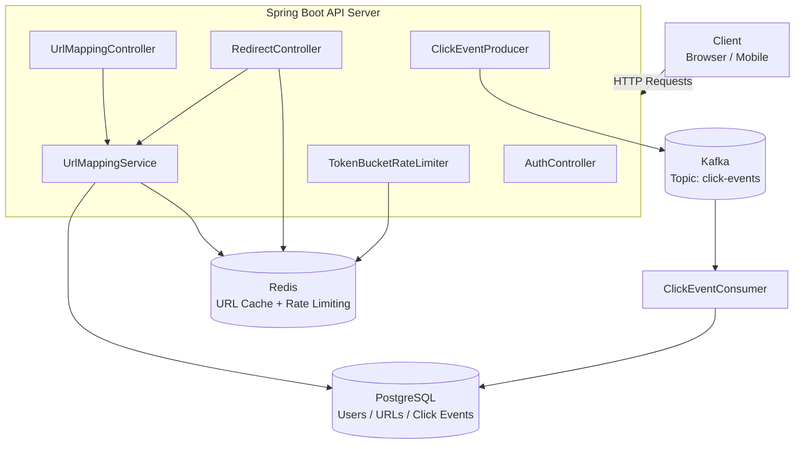
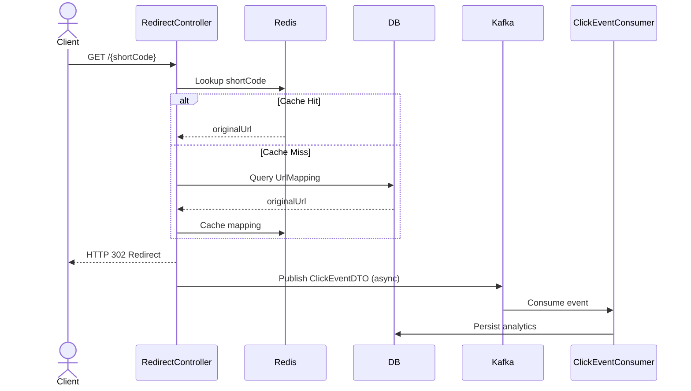
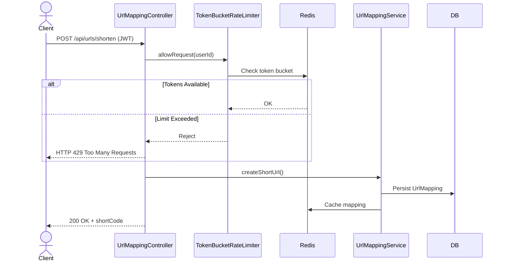

<div align="center">

# ⚡ SnapLink

### Distributed URL Shortener with Real-Time Analytics

[](https://openjdk.org/)
[](https://spring.io/projects/spring-boot)
[](https://redis.io/)
[](https://kafka.apache.org/)
[](https://www.postgresql.org/)
[](https://www.docker.com/)

A high-performance, horizontally scalable URL shortening platform with an event-driven analytics pipeline — built to demonstrate real-world distributed systems patterns.

[Features](#-features) · [Architecture](#-system-architecture) · [Tech Stack](#-tech-stack) · [Getting Started](#-getting-started) · [API Reference](#-api-reference) · [Performance](#-performance) · [Roadmap](#-roadmap)

</div>

---

## 📌 Overview

**SnapLink** is a distributed URL shortening service designed for high-throughput, low-latency redirects. It captures rich click analytics asynchronously via an event-driven pipeline, ensuring the critical redirect path is never blocked by analytics processing.

The project explores and implements several real-world backend architecture patterns:

- ⚡ **Redis caching** for sub-millisecond URL lookups
- 📨 **Event-driven analytics** via Apache Kafka
- 🪣 **Token bucket rate limiting** backed by Redis
- 🔐 **Stateless JWT authentication** with Spring Security
- 📈 **Horizontally scalable** stateless service design

---

## ✨ Features

| Feature | Details |
|---|---|
| 🔗 URL Shortening | Create short links tied to authenticated user accounts |
| ⚡ Fast Redirects | Redis-first lookup path for minimal latency |
| 📊 Click Analytics | Asynchronous capture of IP, user-agent, referrer, and timestamp |
| 🪣 Rate Limiting | Token bucket algorithm enforced per-user via Redis |
| 🔐 Authentication | JWT-based stateless auth using Spring Security |
| 📡 Event Streaming | Kafka-powered async analytics pipeline |
| 🐳 Containerized | Fully Dockerized infrastructure (Postgres, Redis, Kafka) |

---

## 🏗 System Architecture



---

## 🔄 Workflows

<details>
<summary><strong>⚡ Redirect Flow</strong> — optimized for minimal latency</summary>



</details>

<details>
<summary><strong>🔗 URL Creation Flow</strong> — with rate limiting</summary>



</details>

---

## 🧱 Tech Stack

| Layer | Technology |
|---|---|
| **Backend** | Spring Boot 3.x |
| **Database** | PostgreSQL |
| **Cache** | Redis |
| **Message Broker** | Apache Kafka |
| **Authentication** | JWT + Spring Security |
| **Build Tool** | Maven |
| **Containerization** | Docker / Docker Compose |
| **API Testing** | Postman |
| **Load Testing** | Apache JMeter |

---

## 🗄 Data Model

<details>
<summary><strong>View Schema</strong></summary>

**`UrlMapping`**
```
id          BIGINT (PK)
shortCode   VARCHAR UNIQUE
originalUrl TEXT
userId      BIGINT (FK → User)
createdAt   TIMESTAMP
```

**`ClickEvent`**
```
id          BIGINT (PK)
shortCode   VARCHAR
timestamp   TIMESTAMP
ip          VARCHAR
userAgent   TEXT
referrer    VARCHAR
userId      BIGINT
```

**`User`**
```
id            BIGINT (PK)
username      VARCHAR UNIQUE
email         VARCHAR UNIQUE
passwordHash  VARCHAR
```

**Kafka `ClickEventDTO`**
```
shortCode, timestamp, ip, userAgent, referrer, userId
```

</details>

---

## 🔐 Authentication & Rate Limiting

### JWT Authentication
All URL creation endpoints are protected via **Spring Security + JWT**. Tokens must be passed in the `Authorization: Bearer <token>` header.

### Token Bucket Rate Limiter
To prevent abuse, each user is assigned a token bucket stored in Redis:

```
Key format:  user:{userId}:tokens
```

Rate limit headers are included in every response:

```
X-RateLimit-Limit       → Max requests allowed
X-RateLimit-Remaining   → Tokens left in current window
X-RateLimit-Reset       → Unix timestamp for bucket refill
```

---

## 🚀 Getting Started

### Prerequisites

- Java 17+
- Maven 3.8+
- Docker & Docker Compose

### 1. Start Infrastructure

```bash
docker-compose up -d
```

This starts **PostgreSQL**, **Redis**, and **Kafka** locally.

### 2. Configure Environment Variables

Create a `.env` file or export the following:

```env
# Database
SPRING_DATASOURCE_URL=jdbc:postgresql://localhost:5432/snaplink
SPRING_DATASOURCE_USERNAME=your_user
SPRING_DATASOURCE_PASSWORD=your_password

# Redis
SPRING_REDIS_HOST=localhost
SPRING_REDIS_PORT=6379

# Kafka
SPRING_KAFKA_BOOTSTRAP_SERVERS=localhost:9092

# Auth
JWT_SECRET=your_jwt_secret_here

# Rate Limiting
APP_RATE_LIMIT_DEFAULT=100
```

### 3. Build & Run

```bash
mvn clean package
java -jar target/url-shortener.jar
```

> You can also run directly from **IntelliJ IDEA** for a smoother debugging experience.

---

## 📡 API Reference

| Method | Endpoint | Auth | Description |
|---|---|---|---|
| `POST` | `/api/auth/register` | ❌ | Register a new user |
| `POST` | `/api/auth/login` | ❌ | Login and receive JWT |
| `POST` | `/api/urls/shorten` | ✅ | Create a short URL |
| `GET` | `/api/urls` | ✅ | List your short URLs |
| `GET` | `/{shortCode}` | ❌ | Redirect to original URL |
| `GET` | `/api/urls/{shortCode}/analytics` | ✅ | View click analytics |

> All endpoints were tested using **Postman**.

---

## 📁 Project Structure

```
snaplink/
├── src/
│   └── main/
│       ├── java/com/snaplink/
│       │   ├── auth/                  # JWT filters, Spring Security config
│       │   ├── controller/            # REST controllers (Auth, URL, Redirect)
│       │   ├── service/               # Business logic (UrlMappingService)
│       │   ├── repository/            # JPA repositories
│       │   ├── model/                 # Entities (User, UrlMapping, ClickEvent)
│       │   ├── kafka/                 # ClickEventProducer & ClickEventConsumer
│       │   ├── ratelimiter/           # TokenBucketRateLimiter (Redis-backed)
│       │   └── dto/                   # ClickEventDTO and request/response DTOs
│       └── resources/
│           └── application.properties
├── docker-compose.yml
├── pom.xml
└── README.md
```

---

## 📊 Performance

Load tested using **Apache JMeter** under sustained concurrent traffic:

| Metric | Result |
|---|---|
| 🐢 Redirect latency — cache cold (DB only) | ~800ms |
| ⚡ Redirect latency — cache hot (Redis) | ~40ms |
| 📉 Latency improvement via caching | **95% reduction** |
| 🔁 Sustained throughput | **40+ requests/sec** |
| ❌ Error rate under load | **0%** |

**Key architectural decisions that drove these results:**
- Introducing Redis on the hot redirect path cut latency from **800ms → 40ms** using a cache-aside pattern
- Offloading click analytics writes to **Kafka consumers** fully decoupled DB writes from user-facing requests, eliminating analytics processing as a bottleneck

---

## 🗺 Roadmap

- [ ] **Rich IP Analytics** — Geo-location, region, and country-level breakdown per click
- [ ] **Device & Browser Detection** — Classify clicks by device type (desktop / mobile / tablet) and browser from user-agent
- [ ] **QR Code Generation** — Auto-generate a scannable QR code for every shortened URL
- [ ] **Custom Short Codes** — Let users define their own slug (e.g. `/my-brand`)
- [ ] **Link Expiry** — Set a TTL on short URLs with automatic deactivation
- [ ] **Analytics Dashboard UI** — Frontend charts and graphs per short URL
- [ ] **Unit & Integration Tests** — Testcontainers-based test suite covering core flows

---

## 🤝 Contributing

Contributions are welcome! To get started:

1. **Fork** the repository
2. **Create** a feature branch (`git checkout -b feature/your-feature`)
3. **Implement** your changes
4. **Commit** with a clear message (`git commit -m 'feat: add your feature'`)
5. **Push** to your branch and **open a Pull Request**

---

## 👨‍💻 About

SnapLink was built as a distributed systems learning project to practically explore:

- Scalable backend architectures
- Event-driven system design with Kafka
- Caching strategies and cache-aside patterns
- Distributed rate limiting with Redis
- Asynchronous analytics pipelines

---

<div align="center">

If you found this project useful, consider giving it a ⭐

</div>
